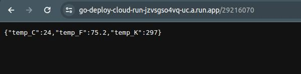

Índice

- [Labs - Deploy Cloud Run](#labs---deploy-cloud-run)
- [Resolução](#resolução)
  - [Executando local](#executando-local)
    - [Docker compose + makefile](#docker-compose--makefile)
    - [Go](#go)
      - [Tests](#tests)
  - [Endereço Google Cloud Run](#endereço-google-cloud-run)

---
# Labs - Deploy Cloud Run

Sistema de temperatura por CEP

**Objetivo**: Desenvolver um sistema em Go que receba um CEP, identifica a cidade e retorna o clima atual (temperatura em graus celsius, fahrenheit e kelvin). Esse sistema deverá ser publicado no Google Cloud Run.

Requisitos:

- O sistema deve receber um CEP válido de 8 digitos
- O sistema deve realizar a pesquisa do CEP e encontrar o nome da localização, a partir disso, deverá retornar as temperaturas e formata-lás em: Celsius, Fahrenheit, Kelvin.
- O sistema deve responder adequadamene nos seguintes cenários:

- Em caso de sucesso:
    - Código HTTP: 200
    - Response Body: { "temp_C": 28.5, "temp_F": 28.5, "temp_K": 28.5 }

- Em caso de falha, caso o CEP não seja válido (com formato correto):
    - Código HTTP: 422
    - Mensagem: invalid zipcode

- ​​​Em caso de falha, caso o CEP não seja encontrado:
    - Código HTTP: 404
    - Mensagem: can not find zipcode

- Deverá ser realizado o deploy no Google Cloud Run.

_Dicas:_

Utilize a API viaCEP (ou similar) para encontrar a localização que deseja consultar a temperatura: https://viacep.com.br/
Utilize a API WeatherAPI (ou similar) para consultar as temperaturas desejadas: https://www.weatherapi.com/
Para realizar a conversão de Celsius para Fahrenheit, utilize a seguinte fórmula: F = C * 1,8 + 32
- Para realizar a conversão de Celsius para Kelvin, utilize a seguinte fórmula: K = C + 273
    - Sendo F = Fahrenheit
    - Sendo C = Celsius
    - Sendo K = Kelvin

_Entrega:_

- O código-fonte completo da implementação.
- Testes automatizados demonstrando o funcionamento.
- Utilize docker/docker-compose para que possamos realizar os testes de sua aplicação.
- Deploy realizado no Google Cloud Run (free tier) e endereço ativo para ser acessado.

---

# Resolução

Foi criado um arquivo Makefile para facilitar o processo via Docker, mas também é possível executar manualmente para visualizar o programa funcionando. 

---

## Executando local

### Docker compose + makefile

```
make local-up
```
---

### Go

```
go run main.go
```

#### Tests

```
go test ./... -v
```


## Endereço Google Cloud Run

[Google Cloud Run](https://go-deploy-cloud-run-jzvsgso4vq-uc.a.run.app/)

- Exemplo de utilizaçao: https://go-deploy-cloud-run-jzvsgso4vq-uc.a.run.app/01153000



---